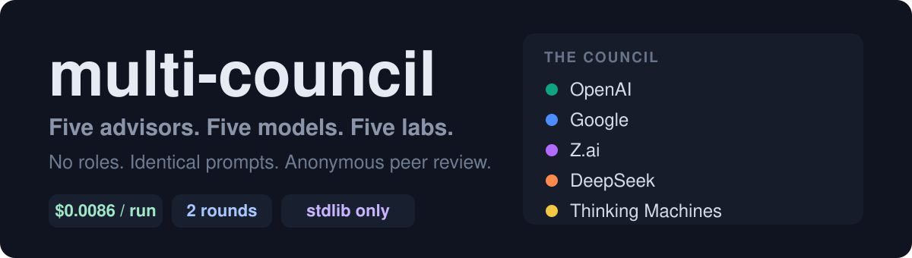
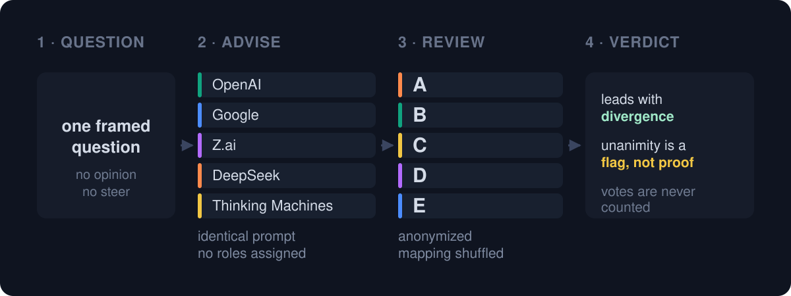

<p align="center">
  
</p>

Run a decision through five advisors on **five different models from five different labs**, have them peer-review each other anonymously, then synthesize a divergence-first verdict.

A [Claude Code](https://claude.com/claude-code) skill.

## Why five models instead of five prompts

The common version of this idea spawns five sub-agents on one model and gives each a persona — the Contrarian, the Optimist, and so on. That produces disagreement, but the disagreement was scripted by the prompts. The advisors share weights, priors, and blind spots, so whatever they agree on may be a shared training artifact rather than a converged truth.

multi-council assigns **no roles**. Every advisor receives an identical prompt. The only thing that differs is the model behind it. Disagreement therefore carries information: it means the models actually see the question differently.

That design choice drives the output format too. The verdict leads with where advisors *diverged*, and explicitly treats unanimity as a flag to check for shared priors rather than as confidence.

<p align="center">
  
</p>

## What it costs

Roughly half a cent to a dime per run, depending on roster. A measured two-round run on the `reference` roster came to **$0.0086** in metered spend, with three of five seats riding existing subscriptions.

## Rosters

Defined in [`rosters.json`](rosters.json).

| Roster | Requires | Approx. cost |
|---|---|---|
| `reference` | ChatGPT Plus, Google One + Antigravity, Z.ai Coding Plan | ~$0.005/run |
| `zero_subscription` | An OpenRouter key only | ~$0.02–0.03/run |
| `frontier` | An OpenRouter key only | ~$0.09–0.10/run |

**Start with `zero_subscription`** unless you already hold the subscriptions the `reference` roster assumes. It needs one API key and nothing else.

## Build your own roster

The `reference` roster is one person's subscription stack. Yours will differ, and editing `rosters.json` is expected — treat the shipped rosters as examples, not defaults you have to live with.

Seats are independent. Each one names a `transport` and a `model`, and you can mix transports freely inside a single roster. If you hold a ChatGPT subscription and an OpenRouter key but nothing else, a perfectly good roster is one `codex` seat plus four `openrouter` seats pointed at four different labs.

```json
{
  "my_roster": {
    "description": "ChatGPT subscription + OpenRouter key.",
    "advisors": [
      {"seat": "gpt",      "transport": "codex",      "model": "<your codex model>"},
      {"seat": "deepseek", "transport": "openrouter", "model": "deepseek/..."},
      {"seat": "qwen",     "transport": "openrouter", "model": "qwen/..."},
      {"seat": "glm",      "transport": "openrouter", "model": "z-ai/..."},
      {"seat": "grok",     "transport": "openrouter", "model": "x-ai/..."}
    ]
  }
}
```

Three things worth knowing before you customize:

**Different labs matter more than different models.** The entire premise is decorrelation. Five models from one provider share pretraining and alignment pressure, so their agreement tells you much less than agreement across five labs. If you must double up on a provider, spend your remaining seats on the most distinct labs you can reach.

**Five seats is not required.** The skill stops and reports a failed council if fewer than three advisors respond, so a three- or four-seat roster works fine. Fewer seats costs less and finishes faster.

**Check modality when picking OpenRouter models.** Verify a model's `architecture.modality` ends in `->text`. OpenRouter serves image, video, speech, embedding, and rerank models alongside text ones, and a non-text seat produces a failed or garbage advisor.

## Setup

Only what your chosen roster actually uses:

| Transport | Requirement |
|---|---|
| `openrouter` | `OPENROUTER_API_KEY` in the environment |
| `claude_zai` | `ZAI_API_KEY` in the environment |
| `codex` | `codex login status` reports logged in |
| `agy` | Antigravity installed and signed in |

Python 3.10+, standard library only — no pip install.

## Install

Copy this directory into your Claude Code skills directory:

```bash
git clone https://github.com/michaelkpate/multi-council
cp -r multi-council ~/.claude/skills/multi-council
```

Then invoke it by saying "council this", "ask the council", or "multi-council this" — or just bring it a real decision.

## Check a roster without spending anything

```bash
python "~/.claude/skills/multi-council/scripts/dispatch.py" --jobs jobs.json --dry-run
```

`--dry-run` prints the plan — seat, transport, model, timeout, prompt size — and makes no network calls. The test suite asserts that it spends nothing.

## Model IDs go stale

`rosters.json` pins specific model IDs. Providers retire them. If a seat starts failing, check the ID against your provider's current catalog first.

If you swap in a different OpenRouter model, verify its `architecture.modality` ends in `->text`. OpenRouter serves image, video, speech, embedding, and rerank models alongside text ones, and a non-text seat yields a failed or garbage advisor. Filter on modality, never on the model's name — `inkling-small` reports `text+image+audio->text` and is a perfectly good advisor because it *emits* text.

## Tests

```bash
python -m pytest tests -q
```

Offline and stdlib-only. No network, no keys, no spend.

## Credit

The council idea comes from [Andrej Karpathy's LLM Council](https://github.com/karpathy/llm-council). This skill grew out of [aiwithremy/claude-skills-llm-council](https://github.com/aiwithremy/claude-skills-llm-council), which implements the single-model sub-agent version.

<p align="center">
  <a href="https://github.com/oil-oil/beautify-github-readme"></a>
</p>

## License

MIT — see [LICENSE](LICENSE).
